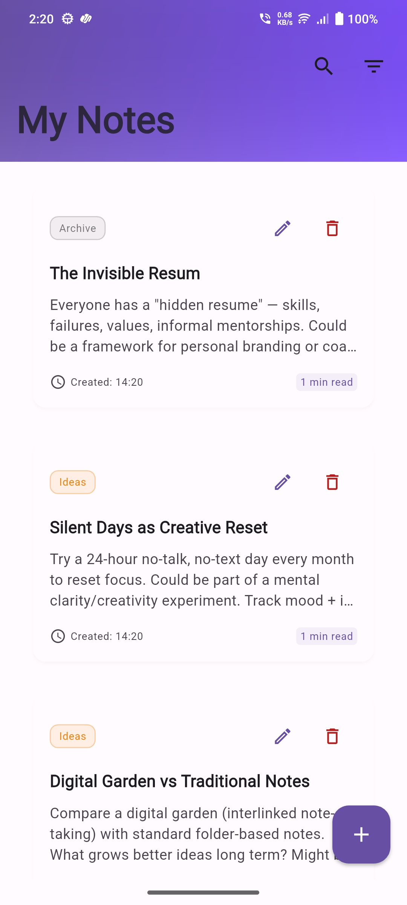
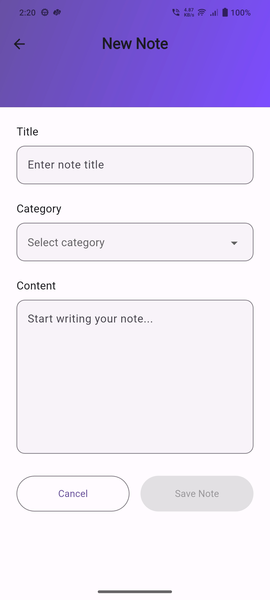
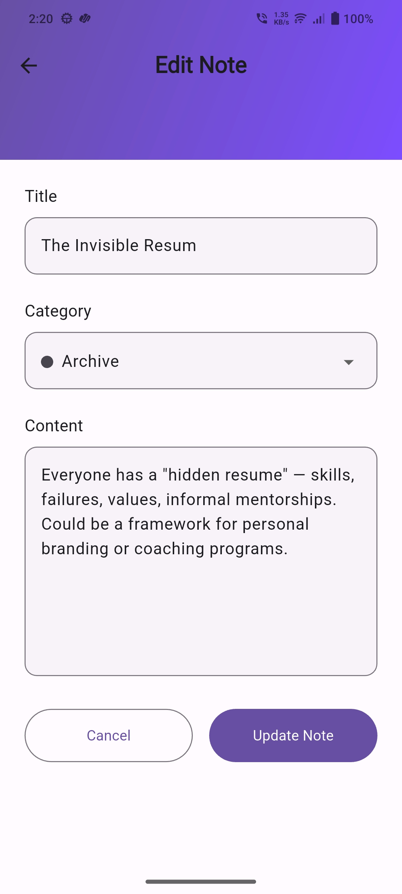
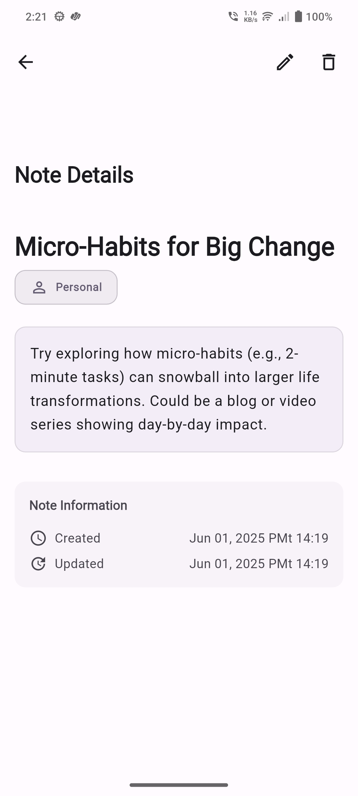
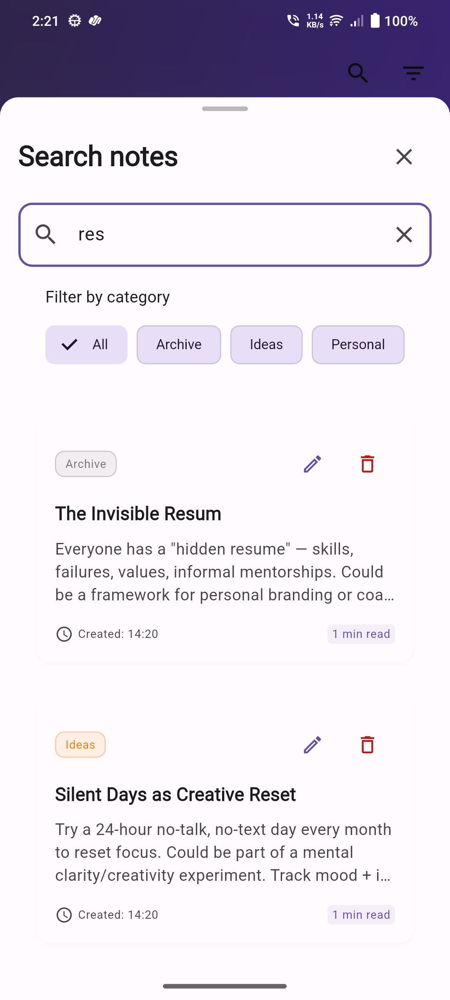
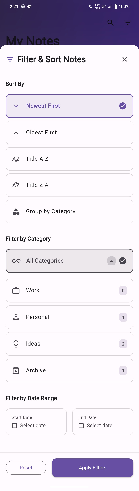
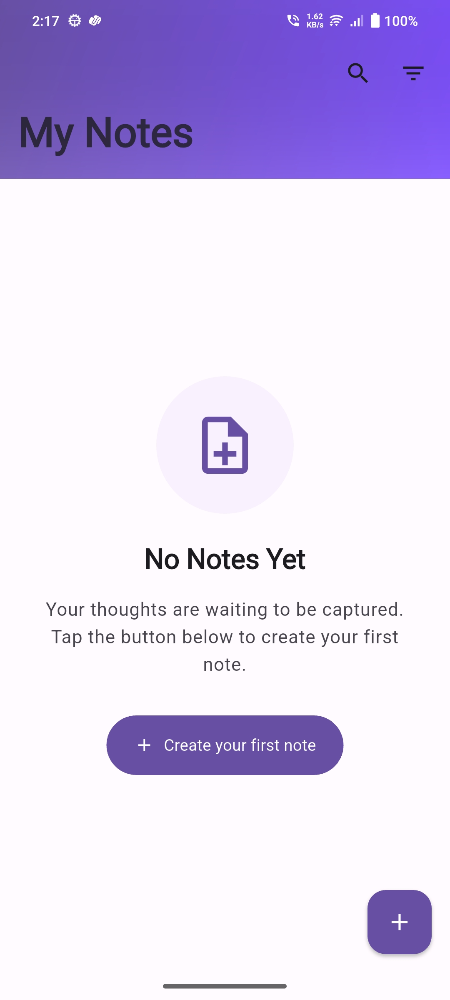
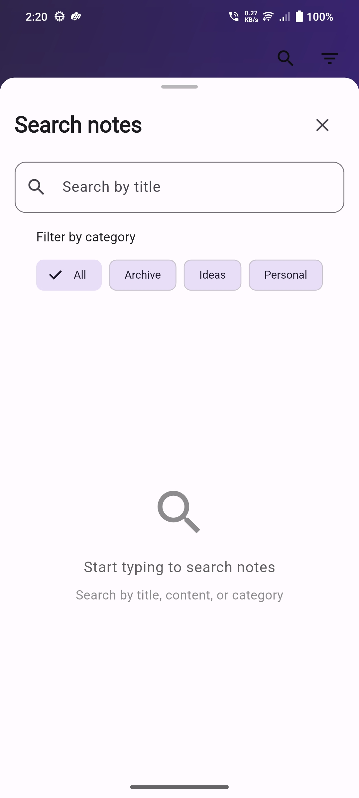
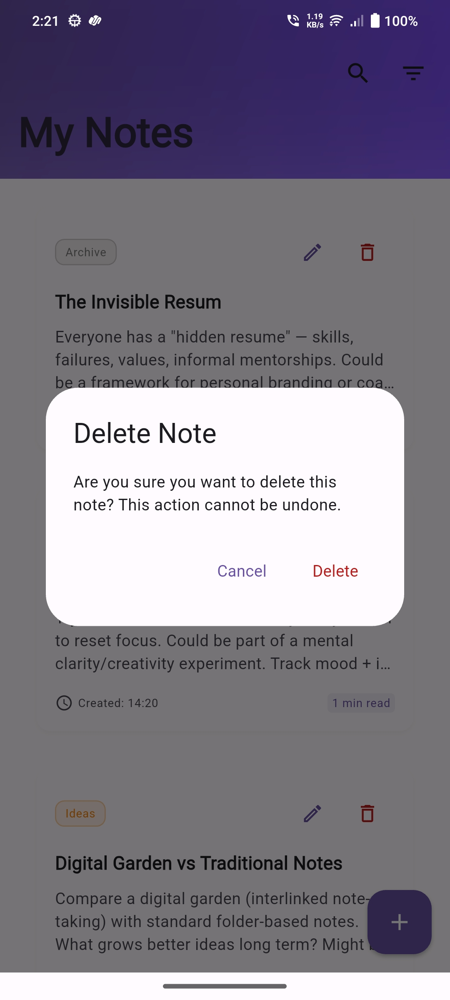

# 📝 Advanced Notes App

An enterprise-grade note-taking application built with Flutter, demonstrating modern development practices, sophisticated architecture patterns, and advanced UI/UX implementation.


## 🚀 Project Overview

This advanced notes application showcases mastery of contemporary Flutter development, featuring sophisticated form handling with `reactive_forms`, complex Sliver-based UI architecture, local data persistence using `Hive`, and enterprise-level code organization.

### 🎯 Key Features

- ✨ **Modern UI/UX**: Material Design 3 implementation with responsive design
- 📝 **Advanced Form Handling**: Reactive forms with comprehensive validation
- 🏗️ **Sliver-Based Architecture**: Custom scroll views with no traditional ListView usage
- 💾 **Local Data Persistence**: Hive database with optimized CRUD operations
- 🔍 **Advanced Search**: Debounced search with real-time filtering
- 📱 **Responsive Design**: Adaptive layouts for mobile, tablet, and desktop
- 🎨 **Custom Widgets**: Reusable components following DRY principles
- ⚡ **Performance Optimized**: Efficient rendering and memory management
- 🧪 **Type Safety**: Immutable models using Freezed and JSON serialization

## 📸 Screenshots

### Main Features

<div align="center">

| Home Screen | Add New Note | Edit Note |
|-------------|--------------|-----------|
|  |  |  |

| Note Details | Search Results | Filter & Sort |
|--------------|----------------|---------------|
|  |  |  |

| Empty States | Search Empty | Delete Confirmation |
|--------------|--------------|-------------------|
|  |  |  |

</div>

## 🏛️ Architecture & Design Patterns

### 🔧 Technical Stack

```yaml
Environment:
  Flutter: ">=3.10.0"
  Dart SDK: ">=3.0.0 <4.0.0"

Core Dependencies:
  - auto_route: ^7.9.2 # Type-safe routing
  - provider: ^6.1.2 # State management
  - get_it: ^7.7.0 # Dependency injection
  - reactive_forms: ^16.1.1 # Advanced form handling
  - freezed: ^2.5.7 # Immutable models
  - json_serializable: ^6.8.0 # JSON handling
  - hive_flutter: ^1.1.0 # Local database
  - rxdart: ^0.28.0 # Reactive programming
  - uuid: ^4.4.2 # Unique identifiers
```

### 📁 Project Structure

```
lib/
├── constants/           # App-wide constants
│   ├── app_colors.dart     # Material Design 3 color palette
│   ├── app_sizes.dart      # Responsive sizing constants
│   ├── app_strings.dart    # Localized text constants
│   └── app_constants.dart  # Business logic constants
├── core/               # Core functionality
│   ├── dependency_injection.dart  # GetIt setup
│   └── exceptions.dart            # Custom exception handling
├── models/             # Data models
│   ├── note.dart          # Note model with Freezed
│   ├── note.freezed.dart  # Generated immutable methods
│   └── note.g.dart       # Generated JSON serialization
├── services/           # Business logic layer
│   └── notes_service.dart # CRUD operations & state management
├── screens/            # UI screens
│   ├── home_screen.dart          # Main notes listing
│   ├── add_edit_note_screen.dart # Note creation/editing
│   └── note_detail_screen.dart   # Note viewing
├── widgets/            # Reusable UI components
│   ├── note_card.dart           # Note display widget
│   ├── search_bottom_sheet.dart # Search functionality
│   └── filter_bottom_sheet.dart # Filtering options
└── utils/              # Helper utilities
    ├── ui_utils.dart      # UI helper functions
    ├── date_utils.dart    # Date formatting utilities
    └── category_utils.dart # Category management
```

## 🚀 Getting Started

### **Prerequisites**

- Flutter SDK (>=3.10.0)
- Dart SDK (>=3.0.0)
- Visual Studio Code or Android Studio
- Git for version control

### **Installation**

1. **Clone the repository**

   ```bash
   git clone https://github.com/Mahesh-Langote/mahesh_langote_advanced_notes_app.git
   cd mahesh_langote_advanced_notes_app
   ```

2. **Install dependencies**

   ```bash
   flutter pub get
   ```

3. **Generate code**

   ```bash
   flutter packages pub run build_runner build --delete-conflicting-outputs
   ```

4. **Run the application**
   ```bash
   flutter run
   ```

### **Build for Production**

```bash
# Android APK
flutter build apk --release

# Android App Bundle
flutter build appbundle --release

# iOS (macOS only)
flutter build ios --release

# Web
flutter build web --release
```

## 🤝 Contributing

1. Fork the repository
2. Create a feature branch (`git checkout -b feature/amazing-feature`)
3. Commit your changes (`git commit -m 'Add amazing feature'`)
4. Push to the branch (`git push origin feature/amazing-feature`)
5. Open a Pull Request
